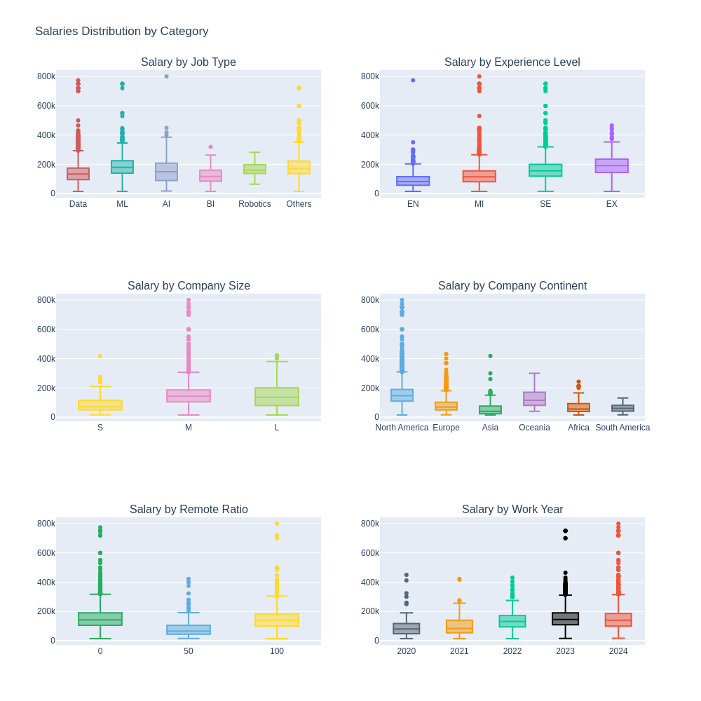
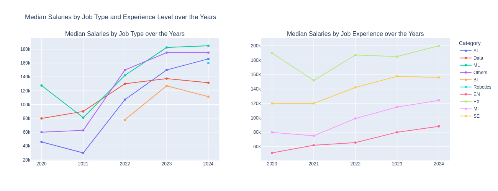
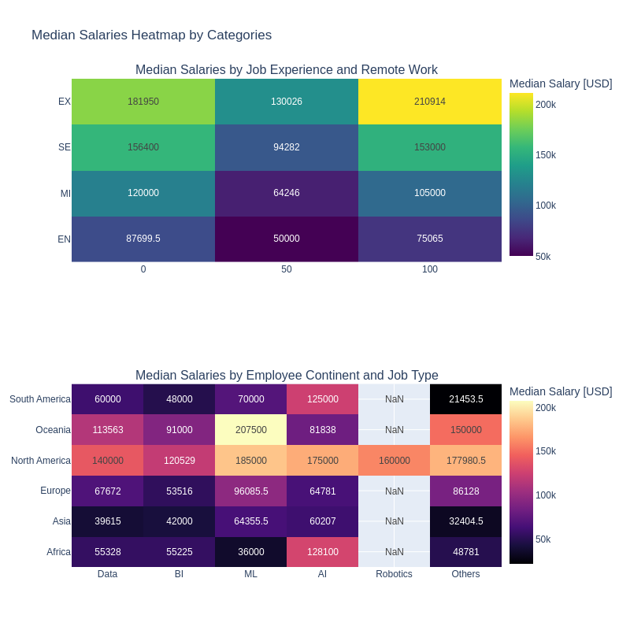

# 💰 Salary Prediction & Insights

A machine learning project (organized by SuperDataScience community) to predict annual salaries for data, AI, and tech roles worldwide. Combines detailed exploratory analysis, advanced feature engineering, best-practice machine learning, symbolic regression, and interpretability dashboards for benchmarking and transparency.

---

## ✨ Features & Capabilities

- Exploratory Data Analysis: Salary distributions, outliers, trends by category.
- Feature Engineering: Job title clustering, continent and GDP mapping, interaction features.
- Machine Learning Models:
  - Random Forest Regressor
  - Bagging with XGBoost
  - Feed-Forward Neural Network (FFNN)
  - Symbolic Regression (PySR) for transparent, interpretable equations.
- Experiment Tracking: MLflow for runs and metrics.
- Streamlit Dashboard:
  - Interactive salary prediction
  - SHAP explanations for feature contributions
  - Salary comparison with global market visuals
- Practical Insights: Salary differences by continent, company size, remote work, and experience.

---

## ⚙️ Installation

1. Clone the repository
    ```
    git clone https://github.com/HienNguyen2311/SDS-CP032-mlpaygrade
    cd mlpaygrade
    ```

2. Install dependencies
    ```
    python -m venv venv
    source venv/bin/activate
    pip install -r requirements.txt
    ```
    Core dependencies:
    - pandas
    - numpy
    - scikit-learn
    - xgboost
    - matplotlib, seaborn, plotly
    - streamlit, shap
    - pysr, mlflow, joblib

---

## ▶️ Usage

- Run Exploratory Notebooks:
  Open notebooks (`EDA&baselines.ipynb`, `SymbolicRegression_&_DeepLearning.ipynb`) in Jupyter, run the former notebook first to get the preprocessed data and the required models to run the app.
- Launch Streamlit App: `app.py`.
This opens the dashboard locally. You can also go to HuggingFace to try my [Salary Prediction App](https://huggingface.co/spaces/hiennguyen231191/salary-prediction-app).

- Programs description:
  `app.py`: Streamlit web app for salary prediction (Random Forest model); shows global market comparison and highlights key feature impacts (SHAP).
  `SymbolicRegression_&_DeepLearning.ipynb` and `EDA&baselines.ipynb`: Notebooks for model training, including EDA, feature engineering, experimentation with deep learning, and interpretable symbolic regression.
  `REPORT-ADV.md`: Detailed documentation of approach, model architectures, comparative results, explainability practices, and deployment overview.

---

## 📂 Data Sources

- [Machine Learning Engineer Salary Dataset](https://www.kaggle.com/datasets/chopper53/machine-learning-engineer-salary-in-2024) – Global salaries for data/AI/tech roles
- [World Bank GDP Data](https://data.worldbank.org/indicator/NY.GDP.MKTP.CD)
- Engineered datasets (job title popularity, KMeans clusters, country-to-continent conversions, GDP integrations, interaction features)

---

## 🛠️ Technologies & Libraries

- Data Processing: pandas, numpy
- Visualization: matplotlib, seaborn, plotly, shap
- Modeling: scikit-learn, xgboost, PySR, PyTorch
- Deployment & Tracking: Streamlit (dashboard interface), MLflow (experiment logging)

---

## 📸 Screenshots

**1. Salary Distribution by Category**



**2. Median Salary by Experience and Job Type**



**3. Median Salaries by Job Experience - Remote Work and Enployee Location - Job Type**



**4. Streamlit Predicted Salary vs Market**


---

## ℹ️ Project Report

This section synthesizes key findings and highlights from the full project report presented for advanced salary prediction in tech/data/AI fields.

---

### 🔍 Exploratory Data Analysis – Key Insights

- *Salary by Role & Experience:*
  - AI/ML roles yield the highest median salaries; significant high-value outliers in “Others” and some Data jobs.
  - Experience level strongly matters: Executives and Seniors earn most, while Entry roles are lowest; confirmed across years.
  - *Salary distributions* show substantial variability even within the same job title.

- *Remote Work Effects:*
  - Fully-remote (100%) roles can have higher outlier salaries but also a wide spread.
  - Executives working remotely see the highest median salaries.
  - Overall, remote ratio does not drastically lower salary.

- *Company & Geographic Variation:*
  - Medium companies tend to pay higher ($143K median) than large ($136K) or small ($71K).
  - North America offers the highest average salaries ($147K median), followed by Oceania and Europe, others much lower.
  - Location and job type clusters show tangible salary banding.

- *Job Title Consistency:*
  - Large variation across similar titles (e.g., Data Scientist vs Data Science Consultant).
  - Boxplots indicate wide interquartile ranges for most job categories.

---

### 🏗️ Feature Engineering – Main Strategies

- High-cardinality features (job_title, employee_residence, company_location) grouped via KMeans and continent mapping for manageability.
- All numerical features standardized; salary target log-transformed to stabilize variability.
- Engineered features: leadership level, experience-job type, experience-continent, job title popularity, clustering, GDP combination.
- Final input schema:
  - 4 ordinal features
  - 12 nominal features (types, geography, engineered interactions)
  - 2 numeric features (popularity, GDP)
  - *Imbalance found* in categorical features; handled via aggregate encodings and clusters.

---

### 🤖 Modeling – Comparison & Performance

- *Best Performing Models:*
  - Bagging Regression & Random Forest slightly outperform Neural Network and Symbolic Regression.
  - Ensembles (tree-based) capture non-linear and categorical relationships best for salary prediction.

- *Metrics Table (Log & USD scale):*
  | Metric   | Random Forest | Bagging | Neural Net | Symbolic Regression |
  |----------|---------------|---------|------------|---------------------|
  | MSE      | 0.12          | 0.11    | 0.12       | 0.13                |
  | RMSE     | 0.34          | 0.33    | 0.35       | 0.36                |
  | MAE      | 0.27          | 0.26    | 0.27       | 0.28                |
  | R²       | 0.48          | 0.50    | 0.46       | 0.42                |

  | Metric   | Random Forest    | Bagging      | Neural Net   | Symbolic Regression |
  |----------|------------------|--------------|--------------|---------------------|
  | MSE      | 2,746,636,331    | 2,680,264,159| 2,922,607,872| 3,028,160,752       |
  | RMSE     | $52,408          | $51,771      | $54,061      | $55,029             |
  | MAE      | $38,338          | $38,151      | $39,074      | $40,069             |

- *Symbolic Regression:*
  - Provides transparent, human-readable formulas for understanding salary drivers.
  - Slightly lower accuracy than ensembles, but far superior explainability.

---

### 🧑‍💻 Model Selection & Tuning – Approach

- Neural network architecture: FFNN with 3 layers (128, 64, 32 units), ReLU + Dropout, log-salary target.
- Symbolic regression tuned with Optuna for equation simplicity and validation performance.
- MLflow used for tracking model architecture, hyperparameters, and all metrics—good for reproducibility.
- Symbolic regression chosen for interpretability; ensemble chosen for best accuracy.

---

### 🚀 Deployment & App Design

- *Streamlit app* supports:
  - Simple, guided input for salary prediction
  - Market comparison histograms
  - SHAP bar chart interpreting the top-5 feature impacts
- Backend logic ensures:
  - Secure user input validation
  - Cloud-hosted model inference (Hugging Face Spaces)
  - Aggregation of engineered features for simple explanations

---

### 🔗 Explainability & Stakeholder Communication

- SHAP explanations presented in intuitive, field-level terms.
- Top feature impacts mapped to simple factors (experience level, role, location).
- Predictions are market estimates, not rigid guarantees; users are encouraged to interpret as guidance.

---

### 📈 Advanced Extensions (Recommended)

- Batch predictions & downloadable benchmark reports
- Personalized recommendations for career/salary improvement
- User account history, what-if analysis tools
- Live market data integration for real-time benchmarking

*For implementation or detailed methodology, refer to the full project report.*

